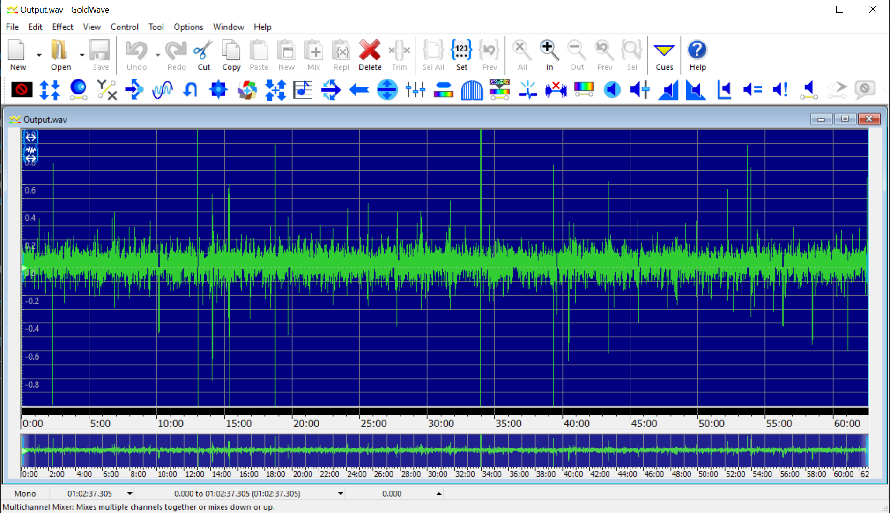
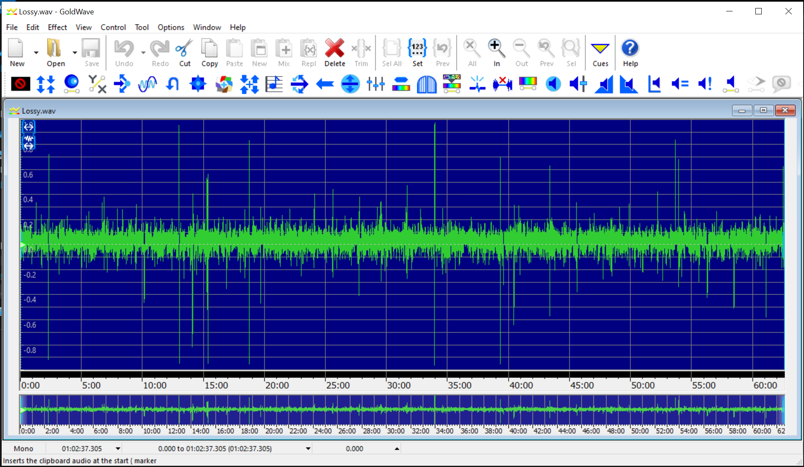

# Neuralink Compression Submission

## Problem Statement

See [Problem](https://content.neuralink.com/compression-challenge/README.html).

## Software Used

7Zip:

```shell
$ 7z

7-Zip 24.05 (x64) : Copyright (c) 1999-2024 Igor Pavlov : 2024-05-14
```

FFMpeg:

```shell
$ ffmpeg
ffmpeg version 6.0-full_build-www.gyan.dev Copyright (c) 2000-2023 the FFmpeg developers
  built with gcc 12.2.0 (Rev10, Built by MSYS2 project)
  configuration: --enable-gpl --enable-version3 --enable-shared --disable-w32threads --disable-autodetect
                 --enable-fontconfig --enable-iconv --enable-gnutls --enable-libxml2 --enable-gmp
                 --enable-bzlib --enable-lzma --enable-libsnappy --enable-zlib --enable-librist --enable-libsrt
                 --enable-libssh --enable-libzmq --enable-avisynth --enable-libbluray --enable-libcaca --enable-sdl2
                 --enable-libaribb24 --enable-libdav1d --enable-libdavs2 --enable-libuavs3d --enable-libzvbi 
                 --enable-librav1e --enable-libsvtav1 --enable-libwebp --enable-libx264 --enable-libx265
                 --enable-libxavs2 --enable-libxvid --enable-libaom --enable-libjxl --enable-libopenjpeg
                 --enable-libvpx --enable-mediafoundation --enable-libass --enable-frei0r --enable-libfreetype
                 --enable-libfribidi --enable-liblensfun --enable-libvidstab --enable-libvmaf --enable-libzimg
                 --enable-amf --enable-cuda-llvm --enable-cuvid --enable-ffnvcodec --enable-nvdec --enable-nvenc
                 --enable-d3d11va --enable-dxva2 --enable-libvpl --enable-libshaderc --enable-vulkan --enable-libplacebo
                 --enable-opencl --enable-libcdio --enable-libgme --enable-libmodplug --enable-libopenmpt
                 --enable-libopencore-amrwb --enable-libmp3lame --enable-libshine --enable-libtheora --enable-libtwolame
                 --enable-libvo-amrwbenc --enable-libilbc --enable-libgsm --enable-libopencore-amrnb --enable-libopus
                 --enable-libspeex --enable-libvorbis --enable-ladspa --enable-libbs2b --enable-libflite --enable-libmysofa
                 --enable-librubberband --enable-libsoxr --enable-chromaprint
  libavutil      58.  2.100 / 58.  2.100
  libavcodec     60.  3.100 / 60.  3.100
  libavformat    60.  3.100 / 60.  3.100
  libavdevice    60.  1.100 / 60.  1.100
  libavfilter     9.  3.100 /  9.  3.100
  libswscale      7.  1.100 /  7.  1.100
  libswresample   4. 10.100 /  4. 10.100
  libpostproc    57.  1.100 / 57.  1.100
```

Python:

```shell
$ python --version
Python 3.12.3
```

SciPy/NumPy:

```shell
$ pip install -U scipy
Requirement already satisfied: scipy in python312\lib\site-packages (1.13.1)
Requirement already satisfied: numpy<2.3,>=1.22.4 in python312\lib\site-packages (from scipy) (1.26.4)
```

GoldWave:

```shell
v6.80
```

## Basic Data Analysis

An analysis of the file in `data.zip` reveals a ton of `.wav` files. First, we want
to find out what are these files, what is the size of metadata in all these files.

We prepare the Data folder by simply unzipping:

```shell
$ 7z x data.zip
```

and we basically try to look at what the data is:

```shell
$ file data/00d4f842-fc92-45f5-8cae-3effdc2245f5.wav
data/00d4f842-fc92-45f5-8cae-3effdc2245f5.wav: RIFF (little-endian) data, WAVE audio, Microsoft PCM, 16 bit, mono 19531 Hz
```

## Audio File Entropy

First, I converted manually to ALAC to see how it fared, and removed all metadata.

```shell
$ du -hs data/00d4f842-fc92-45f5-8cae-3effdc2245f5.wav
196K    data/00d4f842-fc92-45f5-8cae-3effdc2245f5.wav

$ ffmpeg -i data/00d4f842-fc92-45f5-8cae-3effdc2245f5.wav -map_metadata -1 -acodec alac data/00d4f842-fc92-45f5-8cae-3effdc2245f5.m4a

$ du -hs data/00d4f842-fc92-45f5-8cae-3effdc2245f5.m4a
132K    data/00d4f842-fc92-45f5-8cae-3effdc2245f5.m4a
```

I also tried compressing the file individually, and saw that `zip` and `7z` formats did just as badly. 
What is to be remembered is that a streaming format is optimized for lower latencies, and few good streaming
libraries exist for archival formats.

```shell
$ cd data
$ 7z a -tzip -mx9 00d4f842-fc92-45f5-8cae-3effdc2245f5.zip 00d4f842-fc92-45f5-8cae-3effdc2245f5.wav
$ 7z a -t7z -mx9 00d4f842-fc92-45f5-8cae-3effdc2245f5.7z 00d4f842-fc92-45f5-8cae-3effdc2245f5.wav

$ du -hs 00d4f842-fc92-45f5-8cae-3effdc2245f5.zip
$ 75K    00d4f842-fc92-45f5-8cae-3effdc2245f5.zip

$ du -hs 00d4f842-fc92-45f5-8cae-3effdc2245f5.7z
$ 75K    00d4f842-fc92-45f5-8cae-3effdc2245f5.7z
$ cd ..
```

So, 7z still seems to do better in compression ratio. However, there is a lot of unncessary
information stored (file, bytes etc.) in the Zip, and metadata information is redundant and significant,
so what is the impact of eliminating all of that, assuming the textual data can be moved to a side-channel
and encoded much better.

```shell
$ python Scripts/ConcatenateWav.py
$ 7z a -tzip -mx9 Output.zip Output.wav
$ 7z a -tzip -mx9 OutputSide.zip Output.txt

$ du -hs Output.zip
57M     Output.zip

$ du -hs OutputSide.zip
20K     Output.zip
```

We just saved 6MB excluding the list of files and all the extraneous metadata alone. What about `7z`?

```shell
$ 7z a -t7z -mx9 Output.7z Output.wav
$ 7z a -tzip -mx9 OutputSide.7z Output.txt

$ du -hs Output.7z
50M     Output.7z

$ du -hs OutputSide.7z
16K     OutputSide.7z
```

We already improved the baseline by 12MB, a 20% saving. With extremely time-taking compression,
but it gets us very close to the entropy of this file.

This isn't great but it already confirms my suspicions about the file.

## Audio/Perception based Entropy

One of the better approaches to compress this kind of data is based on Fourier transforms. If
we can visualize this file better, we can see if it's random noise or smooth stuff.

It's not random noise, when I concatenated the whole damn thing and opened in
[GoldWave](https://www.goldwave.com/goldwave.php). What I saw was this:

[](Images/GoldWave-Full.png)

So, it looks like it can be compressed lossily, and we can print the PSNR. This
is outside the scope of the assignment, but I want it looked at carefully.

This is how MP3 fares:

```shell
$ ffmpeg -i Output.wav -c:a mp3 Output.mp3

$ du -hs Output.mp3
15M    Output.mp3
```

and 64 kbps Opus:

```shell
$ ffmpeg -i Output.wav -c:a libopus Output.opus

$ du -hs Output.opus
30M     Output.opus
```

and 32 kbps Opus:

```shell
$ ffmpeg -i Output.wav -b:a 32k -c:a libopus Output.opus

$ du -hs Output.opus
14M     Output.opus
```

and back:

```shell
$ ffmpeg -i Output.opus -ar 19531 Lossy.wav

$ du -hs Lossy.wav
140M    Lossy.wav
```

Already at a further 40-80% reduction in size. What is the perceptual
difference between these files?

For MP3:

```shell
$shell Scripts/SNR.py
Output.wav => 0.30912332921100283
Lossy.wav => 0.3086850807150957
```

For 64 kbps Opus:

```shell
$ python Scripts/SNR.py
Output.wav => 0.30912332921100283
Lossy.wav => 0.0002217705736148185
```

For 32 kbps Opus:

```shell
$ python Scripts/SNR.py
Output.wav => 0.30912332921100283
Lossy.wav => -2.963617756168254e-05
```

MP3 seems to be Viable?!! The WaveForm Image Comparison
does not appear to be bad at all! Of course it's not 
lossless, but it's already 1/4th of the Zip file size to
begin with.

[](Images/GoldWave-Lossy.png)

If Neuralink Scientists are interested, they should
give this a try and see how it fares in lab tests.


## Feedback

I did this exercise for fun. People should check out all the Hutter Prize algorithms
to compress this wall of lossless signals, but in all likelyhood their current chips can't compress
as fast to meet the latency challenges.

I think lossy compression might have a bright future if a good SNR value can be determined.

All feedback welcome!

* Author: Karthik Kumar Viswanathan
* Web   : http://karthikkumar.org
* Email : me@karthikkumar.org

